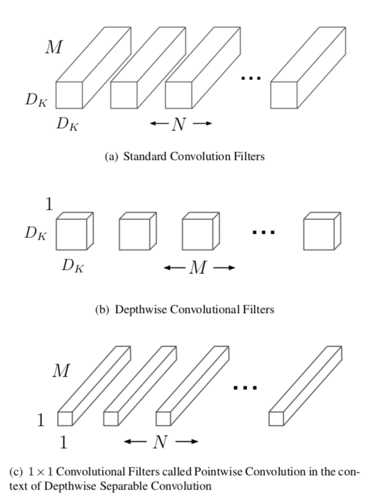

# Tensorflow模型转换之TFJS、Tensorflow Lite
```
最近在搭建一个人工智能学习平台，主要包括在线训练图像分类模型、自学习聊天机器人、模型在线转换等功能。  
本篇文章主要讲解如何将训练好的Save Model模型，转换成移动端使用的Tensorflow Lite模型与Web端使用的Tensorflow JS模型。  
此处我们以Posenet为例来实现Lite与JS模型的转换。
```

> Anaconda : 4.5.11  
> Tensorflow : 1.12.0  
> Tensorflowjs : 0.8.0  
> Opencv3\(menpo\) : 3.1.0  
> 系统环境 : Mac OSX 10.14.3  
> Python\(Opencv需要3.5\) : 3.5.4  
> MobileNetV1 : 0.75

_转载文章请注明来源及作者_

Posenet是Tensorflow.js官方推荐的例子，本文不再赘述，感兴趣的话可以参考另篇文章[Posenet](http://www.kuture.com.cn/2019/01/24/PoseNet动作识别/)

## Tensorflow格式之间的转换

Tensorflow官方文档中，对GraphDef\(.pb\)、FrozenGraphDef\(带有冻结变量的.pb\)、SavedModel\(.pb - 用于推断服务器端的通用格式\)和Checkpoint文件\(在训练过程中的序列化变量\)有明确的解释，其转换过程如下图所示：


如果要转换tfjs或者Lite模型可以使用Keras的HDF5、SaveModel或者Froen Graphdef。由于目前Posenet只有tfjs版，为了更好的分解网络结构,我们先将js版转换为Python版的Posenet，然后再将tensorflow生成的SaveModel\(.pb\) 与 Checkpoints\(.ckpt\)，使用freeze\_graph固化得到Frozen Graph\(.pb\)，此时的Frozen Graph\(.pb\)模型就可转换成Lite与tfjs模型了。
在进行模型转换之前，我们先熟悉一下MobileNet

> 鉴于Python版的Posenet重建过程较为复杂且不是当前文章的重点，所以此处关于Python版的重建过程不再赘述。

## MobileNet\_V1

#### 深度可分离卷积
MobileNets基于一种流线型结构使用深度可分离卷积来构造轻型权重的深度神经网络，深度可分离卷积是一种将标准卷积分解成深度卷积以及一个1x1的卷积即逐点卷积。对于MobileNet而言，深度卷积针对每个单个输入通道应用单个滤波器进行滤波，然后逐点卷积应用1x1的卷积操作来结合所有深度卷积得到的输出。而标准卷积一步即对所有的输入进行结合得到新的一系列输出。深度可分离卷积将其分成了两步，针对每个单独层进行滤波然后下一步即结合。这种分解能够有效的大量减少计算量以及模型的大小。如图1所示，一个标准的卷积1\(a\)被分解成深度卷积1\(b\)以及1x1的逐点卷积1\(c\)。   


* 一个标准卷积层输入DF∗DF∗M的特征图F，并得到一个DG∗DG∗N的输出特征图G，其中DF表示输入特征图的宽和高，M是输入的通道数（输入的深度）DG为输出特征图的宽和高，N是输出的通道数（输出的深度）。  
* 标准卷积层通过由大小为DK∗DK∗M∗N个卷积核K个参数，其中DK是卷积核的空间维数，M是输入通道数，N是输出通道数。  
标准卷积的输出的卷积图，假设步长为1，则padding由下式计算：Gk,l,n=∑i,j,mKi,j,m,n⋅Fk+i−1,l+j−1,m。其计算量为DK∗DK∗M∗N∗DF∗DF，其由输入通道数M、输出通道数N、卷积核大小DK、输出特征图大小DF决定。MobileNet模型针对其进行改进。首先，使用深度可分离卷积来打破输出通道数与卷积核大小之间的相互连接作用。  
* 标准的卷积操作基于卷积核和组合特征来对滤波特征产生效果来产生一种新的表示。滤波和组合能够通过分解卷积操作来分成两个独立的部分，这就叫做深度可分离卷积，可以大幅度降度计算成本。  
* 深度可分离卷积由两层构成：深度卷积和逐点卷积。我们使用深度卷积来针对每一个输入通道用单个卷积核进行卷积，得到输入通道数的深度，然后运用逐点卷积，即应用一个简单的1x1卷积，来对深度卷积中的输出进行线性结合。MobileNets对每层使用batchnorm和ReLU非线性激活。  
* 深度卷积对每个通道使用一种卷积核，可以写成：Gk,l,m^=∑i,jKi,j,m^⋅Fk+i−1,l+j−1,m，其中K̂ 是深度卷积核的尺寸DK∗DK∗M，K̂ 中第m个卷积核应用于F中的第m个通道来产生第m个通道的卷积输出特征图Ĝ 。  
* 深度卷积的计算量为：DK∗DK∗M∗DF∗DF。  
* 深度卷积相对于标准卷积十分有效，然而其只对输入通道进行卷积，没有对其进行组合来产生新的特征。因此下一层利用另外的层利用1x1卷积来对深度卷积的输出计算一个线性组合从而产生新的特征。  
* 那么深度卷积加上1x1卷积的逐点卷积的结合就叫做深度可分离卷积，最开始在（Rigid-motion scattering for image classification.）中被提出。  
* 深度可分离卷积的计算量为：DK∗DK∗M∗DF∗DF+M∗N∗DF∗DF,即深度卷积和1x1的逐点卷积的和。  
* 通过将卷积分为滤波和组合的过程得到对计算量的缩减：
* MobileNet使用3x3的深度可分离卷积相较于标准卷积少了8到9倍的计算量，然而只有极小的准确率的下降如第4节。  
* 另外的空间维数的分解方式如（Flattenedconvolutional neural networks for feedforward acceleration）（Rethinking the inception architecture for computer vision.）中。但是相较于深度可分离卷积，计算量的减少也没有这么多。

#### MobileNet网络结构
MobileNet结构就像前面所提到的由深度可分离卷积所构成，且除了第一层之外为全卷积。通过用这些简单的项定义网络能够更容易的探索网络的拓扑结构来找到一个更好的网络。MobileNet结构由下表1定义。


## Tensorflow Lite 模型转换
#### 查看Frozen Graph模型中的变量名称
模型在转换时需要知道模型的输入与输出节点，所以我们先查看一下模型转换后的变量名称，确定模型输入与输出节点。

```
import tensorflow as tf
# graph_model_path 为Frozen Graph模型的路径
with tf.gfile.GFile(graph_model_path, 'rb') as rf:
    graph_def = tf.GraphDef()
    graph_def.ParseFromString(rf.read())

with tf.Graph().as_default() as graph:
    tf.import_graph_def(graph_def, name='')
    i = 0
    opname_list = []
    for op in graph.get_operations():
        print(i, ' : ', op.name, op.values())
        opname_list.append(op.name)
        i += 1
```

Frozen Graph格式的Posenet模型：

```
0  :  MobilenetV1/Conv2d_3_pointwise/biases (<tf.Tensor 'MobilenetV1/Conv2d_3_pointwise/biases:0' shape=(96,) dtype=float32>,)
1  :  MobilenetV1/Conv2d_3_pointwise/biases/read (<tf.Tensor 'MobilenetV1/Conv2d_3_pointwise/biases/read:0' shape=(96,) dtype=float32>,)
2  :  MobilenetV1/Conv2d_1_pointwise/biases (<tf.Tensor 'MobilenetV1/Conv2d_1_pointwise/biases:0' shape=(48,) dtype=float32>,)
3  :  MobilenetV1/Conv2d_1_pointwise/biases/read (<tf.Tensor 'MobilenetV1/Conv2d_1_pointwise/biases/read:0' shape=(48,) dtype=float32>,)
4  :  MobilenetV1/displacement_fwd_2/weights (<tf.Tensor 'MobilenetV1/displacement_fwd_2/weights:0' shape=(1, 1, 384, 32) dtype=float32>,)
5  :  MobilenetV1/displacement_fwd_2/weights/read (<tf.Tensor 'MobilenetV1/displacement_fwd_2/weights/read:0' shape=(1, 1, 384, 32) dtype=float32>,)
6  :  MobilenetV1/Conv2d_5_pointwise/biases (<tf.Tensor 'MobilenetV1/Conv2d_5_pointwise/biases:0' shape=(192,) dtype=float32>,)
7  :  MobilenetV1/Conv2d_5_pointwise/biases/read (<tf.Tensor 'MobilenetV1/Conv2d_5_pointwise/biases/read:0' shape=(192,) dtype=float32>,)
8  :  MobilenetV1/Conv2d_1_depthwise/depthwise_weights (<tf.Tensor 'MobilenetV1/Conv2d_1_depthwise/depthwise_weights:0' shape=(3, 3, 24, 1) dtype=float32>,)
9  :  MobilenetV1/Conv2d_1_depthwise/depthwise_weights/read (<tf.Tensor 'MobilenetV1/Conv2d_1_depthwise/depthwise_weights/read:0' shape=(3, 3, 24, 1) dtype=float32>,)
10  :  MobilenetV1/Conv2d_13_depthwise/depthwise_weights (<tf.Tensor 'MobilenetV1/Conv2d_13_depthwise/depthwise_weights:0' shape=(3, 3, 384, 1) dtype=float32>,)
11  :  MobilenetV1/Conv2d_13_depthwise/depthwise_weights/read (<tf.Tensor 'MobilenetV1/Conv2d_13_depthwise/depthwise_weights/read:0' shape=(3, 3, 384, 1) dtype=float32>,)
12  :  MobilenetV1/Conv2d_8_depthwise/depthwise_weights (<tf.Tensor 'MobilenetV1/Conv2d_8_depthwise/depthwise_weights:0' shape=(3, 3, 384, 1) dtype=float32>,)
13  :  MobilenetV1/Conv2d_8_depthwise/depthwise_weights/read (<tf.Tensor 'MobilenetV1/Conv2d_8_depthwise/depthwise_weights/read:0' shape=(3, 3, 384, 1) dtype=float32>,)
14  :  MobilenetV1/Conv2d_1_pointwise/weights (<tf.Tensor 'MobilenetV1/Conv2d_1_pointwise/weights:0' shape=(1, 1, 24, 48) dtype=float32>,)
15  :  MobilenetV1/Conv2d_1_pointwise/weights/read (<tf.Tensor 'MobilenetV1/Conv2d_1_pointwise/weights/read:0' shape=(1, 1, 24, 48) dtype=float32>,)
16  :  MobilenetV1/Conv2d_2_depthwise/biases (<tf.Tensor 'MobilenetV1/Conv2d_2_depthwise/biases:0' shape=(48,) dtype=float32>,)
17  :  MobilenetV1/Conv2d_2_depthwise/biases/read (<tf.Tensor 'MobilenetV1/Conv2d_2_depthwise/biases/read:0' shape=(48,) dtype=float32>,)
18  :  MobilenetV1/Conv2d_9_depthwise/depthwise_weights (<tf.Tensor 'MobilenetV1/Conv2d_9_depthwise/depthwise_weights:0' shape=(3, 3, 384, 1) dtype=float32>,)
19  :  MobilenetV1/Conv2d_9_depthwise/depthwise_weights/read (<tf.Tensor 'MobilenetV1/Conv2d_9_depthwise/depthwise_weights/read:0' shape=(3, 3, 384, 1) dtype=float32>,)
20  :  MobilenetV1/offset_2/weights (<tf.Tensor 'MobilenetV1/offset_2/weights:0' shape=(1, 1, 384, 34) dtype=float32>,)
21  :  MobilenetV1/offset_2/weights/read (<tf.Tensor 'MobilenetV1/offset_2/weights/read:0' shape=(1, 1, 384, 34) dtype=float32>,)
22  :  MobilenetV1/Conv2d_12_depthwise/depthwise_weights (<tf.Tensor 'MobilenetV1/Conv2d_12_depthwise/depthwise_weights:0' shape=(3, 3, 384, 1) dtype=float32>,)
23  :  MobilenetV1/Conv2d_12_depthwise/depthwise_weights/read (<tf.Tensor 'MobilenetV1/Conv2d_12_depthwise/depthwise_weights/read:0' shape=(3, 3, 384, 1) dtype=float32>,)
24  :  MobilenetV1/Conv2d_4_depthwise/biases (<tf.Tensor 'MobilenetV1/Conv2d_4_depthwise/biases:0' shape=(96,) dtype=float32>,)
25  :  MobilenetV1/Conv2d_4_depthwise/biases/read (<tf.Tensor 'MobilenetV1/Conv2d_4_depthwise/biases/read:0' shape=(96,) dtype=float32>,)
26  :  MobilenetV1/Conv2d_6_depthwise/depthwise_weights (<tf.Tensor 'MobilenetV1/Conv2d_6_depthwise/depthwise_weights:0' shape=(3, 3, 192, 1) dtype=float32>,)
27  :  MobilenetV1/Conv2d_6_depthwise/depthwise_weights/read (<tf.Tensor 'MobilenetV1/Conv2d_6_depthwise/depthwise_weights/read:0' shape=(3, 3, 192, 1) dtype=float32>,)
28  :  MobilenetV1/Conv2d_6_pointwise/biases (<tf.Tensor 'MobilenetV1/Conv2d_6_pointwise/biases:0' shape=(384,) dtype=float32>,)
29  :  MobilenetV1/Conv2d_6_pointwise/biases/read (<tf.Tensor 'MobilenetV1/Conv2d_6_pointwise/biases/read:0' shape=(384,) dtype=float32>,)
30  :  MobilenetV1/Conv2d_12_depthwise/biases (<tf.Tensor 'MobilenetV1/Conv2d_12_depthwise/biases:0' shape=(384,) dtype=float32>,)
31  :  MobilenetV1/Conv2d_12_depthwise/biases/read (<tf.Tensor 'MobilenetV1/Conv2d_12_depthwise/biases/read:0' shape=(384,) dtype=float32>,)
32  :  MobilenetV1/Conv2d_5_depthwise/biases (<tf.Tensor 'MobilenetV1/Conv2d_5_depthwise/biases:0' shape=(192,) dtype=float32>,)
33  :  MobilenetV1/Conv2d_5_depthwise/biases/read (<tf.Tensor 'MobilenetV1/Conv2d_5_depthwise/biases/read:0' shape=(192,) dtype=float32>,)
34  :  MobilenetV1/Conv2d_8_pointwise/weights (<tf.Tensor 'MobilenetV1/Conv2d_8_pointwise/weights:0' shape=(1, 1, 384, 384) dtype=float32>,)
35  :  MobilenetV1/Conv2d_8_pointwise/weights/read (<tf.Tensor 'MobilenetV1/Conv2d_8_pointwise/weights/read:0' shape=(1, 1, 384, 384) dtype=float32>,)
36  :  MobilenetV1/Conv2d_0/biases (<tf.Tensor 'MobilenetV1/Conv2d_0/biases:0' shape=(24,) dtype=float32>,)
37  :  MobilenetV1/Conv2d_0/biases/read (<tf.Tensor 'MobilenetV1/Conv2d_0/biases/read:0' shape=(24,) dtype=float32>,)
38  :  MobilenetV1/Conv2d_7_pointwise/weights (<tf.Tensor 'MobilenetV1/Conv2d_7_pointwise/weights:0' shape=(1, 1, 384, 384) dtype=float32>,)
39  :  MobilenetV1/Conv2d_7_pointwise/weights/read (<tf.Tensor 'MobilenetV1/Conv2d_7_pointwise/weights/read:0' shape=(1, 1, 384, 384) dtype=float32>,)
40  :  MobilenetV1/Conv2d_2_pointwise/weights (<tf.Tensor 'MobilenetV1/Conv2d_2_pointwise/weights:0' shape=(1, 1, 48, 96) dtype=float32>,)
41  :  MobilenetV1/Conv2d_2_pointwise/weights/read (<tf.Tensor 'MobilenetV1/Conv2d_2_pointwise/weights/read:0' shape=(1, 1, 48, 96) dtype=float32>,)
42  :  MobilenetV1/heatmap_2/weights (<tf.Tensor 'MobilenetV1/heatmap_2/weights:0' shape=(1, 1, 384, 17) dtype=float32>,)
43  :  MobilenetV1/heatmap_2/weights/read (<tf.Tensor 'MobilenetV1/heatmap_2/weights/read:0' shape=(1, 1, 384, 17) dtype=float32>,)
44  :  MobilenetV1/Conv2d_9_pointwise/biases (<tf.Tensor 'MobilenetV1/Conv2d_9_pointwise/biases:0' shape=(384,) dtype=float32>,)
45  :  MobilenetV1/Conv2d_9_pointwise/biases/read (<tf.Tensor 'MobilenetV1/Conv2d_9_pointwise/biases/read:0' shape=(384,) dtype=float32>,)
46  :  MobilenetV1/Conv2d_7_pointwise/biases (<tf.Tensor 'MobilenetV1/Conv2d_7_pointwise/biases:0' shape=(384,) dtype=float32>,)
47  :  MobilenetV1/Conv2d_7_pointwise/biases/read (<tf.Tensor 'MobilenetV1/Conv2d_7_pointwise/biases/read:0' shape=(384,) dtype=float32>,)
48  :  MobilenetV1/Conv2d_7_depthwise/depthwise_weights (<tf.Tensor 'MobilenetV1/Conv2d_7_depthwise/depthwise_weights:0' shape=(3, 3, 384, 1) dtype=float32>,)
49  :  MobilenetV1/Conv2d_7_depthwise/depthwise_weights/read (<tf.Tensor 'MobilenetV1/Conv2d_7_depthwise/depthwise_weights/read:0' shape=(3, 3, 384, 1) dtype=float32>,)
50  :  MobilenetV1/heatmap_2/biases (<tf.Tensor 'MobilenetV1/heatmap_2/biases:0' shape=(17,) dtype=float32>,)
51  :  MobilenetV1/heatmap_2/biases/read (<tf.Tensor 'MobilenetV1/heatmap_2/biases/read:0' shape=(17,) dtype=float32>,)
52  :  MobilenetV1/Conv2d_10_pointwise/biases (<tf.Tensor 'MobilenetV1/Conv2d_10_pointwise/biases:0' shape=(384,) dtype=float32>,)
53  :  MobilenetV1/Conv2d_10_pointwise/biases/read (<tf.Tensor 'MobilenetV1/Conv2d_10_pointwise/biases/read:0' shape=(384,) dtype=float32>,)
54  :  MobilenetV1/Conv2d_13_pointwise/weights (<tf.Tensor 'MobilenetV1/Conv2d_13_pointwise/weights:0' shape=(1, 1, 384, 384) dtype=float32>,)
55  :  MobilenetV1/Conv2d_13_pointwise/weights/read (<tf.Tensor 'MobilenetV1/Conv2d_13_pointwise/weights/read:0' shape=(1, 1, 384, 384) dtype=float32>,)
56  :  MobilenetV1/Conv2d_6_depthwise/biases (<tf.Tensor 'MobilenetV1/Conv2d_6_depthwise/biases:0' shape=(192,) dtype=float32>,)
57  :  MobilenetV1/Conv2d_6_depthwise/biases/read (<tf.Tensor 'MobilenetV1/Conv2d_6_depthwise/biases/read:0' shape=(192,) dtype=float32>,)
58  :  MobilenetV1/Conv2d_10_depthwise/depthwise_weights (<tf.Tensor 'MobilenetV1/Conv2d_10_depthwise/depthwise_weights:0' shape=(3, 3, 384, 1) dtype=float32>,)
59  :  MobilenetV1/Conv2d_10_depthwise/depthwise_weights/read (<tf.Tensor 'MobilenetV1/Conv2d_10_depthwise/depthwise_weights/read:0' shape=(3, 3, 384, 1) dtype=float32>,)
60  :  MobilenetV1/Conv2d_3_depthwise/depthwise_weights (<tf.Tensor 'MobilenetV1/Conv2d_3_depthwise/depthwise_weights:0' shape=(3, 3, 96, 1) dtype=float32>,)
61  :  MobilenetV1/Conv2d_3_depthwise/depthwise_weights/read (<tf.Tensor 'MobilenetV1/Conv2d_3_depthwise/depthwise_weights/read:0' shape=(3, 3, 96, 1) dtype=float32>,)
62  :  MobilenetV1/Conv2d_8_pointwise/biases (<tf.Tensor 'MobilenetV1/Conv2d_8_pointwise/biases:0' shape=(384,) dtype=float32>,)
63  :  MobilenetV1/Conv2d_8_pointwise/biases/read (<tf.Tensor 'MobilenetV1/Conv2d_8_pointwise/biases/read:0' shape=(384,) dtype=float32>,)
64  :  MobilenetV1/Conv2d_11_depthwise/biases (<tf.Tensor 'MobilenetV1/Conv2d_11_depthwise/biases:0' shape=(384,) dtype=float32>,)
65  :  MobilenetV1/Conv2d_11_depthwise/biases/read (<tf.Tensor 'MobilenetV1/Conv2d_11_depthwise/biases/read:0' shape=(384,) dtype=float32>,)
66  :  MobilenetV1/Conv2d_5_pointwise/weights (<tf.Tensor 'MobilenetV1/Conv2d_5_pointwise/weights:0' shape=(1, 1, 192, 192) dtype=float32>,)
67  :  MobilenetV1/Conv2d_5_pointwise/weights/read (<tf.Tensor 'MobilenetV1/Conv2d_5_pointwise/weights/read:0' shape=(1, 1, 192, 192) dtype=float32>,)
68  :  MobilenetV1/Conv2d_4_depthwise/depthwise_weights (<tf.Tensor 'MobilenetV1/Conv2d_4_depthwise/depthwise_weights:0' shape=(3, 3, 96, 1) dtype=float32>,)
69  :  MobilenetV1/Conv2d_4_depthwise/depthwise_weights/read (<tf.Tensor 'MobilenetV1/Conv2d_4_depthwise/depthwise_weights/read:0' shape=(3, 3, 96, 1) dtype=float32>,)
70  :  MobilenetV1/Conv2d_0/weights (<tf.Tensor 'MobilenetV1/Conv2d_0/weights:0' shape=(3, 3, 3, 24) dtype=float32>,)
71  :  MobilenetV1/Conv2d_0/weights/read (<tf.Tensor 'MobilenetV1/Conv2d_0/weights/read:0' shape=(3, 3, 3, 24) dtype=float32>,)
72  :  MobilenetV1/Conv2d_2_depthwise/depthwise_weights (<tf.Tensor 'MobilenetV1/Conv2d_2_depthwise/depthwise_weights:0' shape=(3, 3, 48, 1) dtype=float32>,)
73  :  MobilenetV1/Conv2d_2_depthwise/depthwise_weights/read (<tf.Tensor 'MobilenetV1/Conv2d_2_depthwise/depthwise_weights/read:0' shape=(3, 3, 48, 1) dtype=float32>,)
74  :  MobilenetV1/Conv2d_7_depthwise/biases (<tf.Tensor 'MobilenetV1/Conv2d_7_depthwise/biases:0' shape=(384,) dtype=float32>,)
75  :  MobilenetV1/Conv2d_7_depthwise/biases/read (<tf.Tensor 'MobilenetV1/Conv2d_7_depthwise/biases/read:0' shape=(384,) dtype=float32>,)
76  :  MobilenetV1/Conv2d_10_depthwise/biases (<tf.Tensor 'MobilenetV1/Conv2d_10_depthwise/biases:0' shape=(384,) dtype=float32>,)
77  :  MobilenetV1/Conv2d_10_depthwise/biases/read (<tf.Tensor 'MobilenetV1/Conv2d_10_depthwise/biases/read:0' shape=(384,) dtype=float32>,)
78  :  MobilenetV1/Conv2d_6_pointwise/weights (<tf.Tensor 'MobilenetV1/Conv2d_6_pointwise/weights:0' shape=(1, 1, 192, 384) dtype=float32>,)
79  :  MobilenetV1/Conv2d_6_pointwise/weights/read (<tf.Tensor 'MobilenetV1/Conv2d_6_pointwise/weights/read:0' shape=(1, 1, 192, 384) dtype=float32>,)
80  :  MobilenetV1/Conv2d_11_depthwise/depthwise_weights (<tf.Tensor 'MobilenetV1/Conv2d_11_depthwise/depthwise_weights:0' shape=(3, 3, 384, 1) dtype=float32>,)
81  :  MobilenetV1/Conv2d_11_depthwise/depthwise_weights/read (<tf.Tensor 'MobilenetV1/Conv2d_11_depthwise/depthwise_weights/read:0' shape=(3, 3, 384, 1) dtype=float32>,)
82  :  MobilenetV1/Conv2d_1_depthwise/biases (<tf.Tensor 'MobilenetV1/Conv2d_1_depthwise/biases:0' shape=(24,) dtype=float32>,)
83  :  MobilenetV1/Conv2d_1_depthwise/biases/read (<tf.Tensor 'MobilenetV1/Conv2d_1_depthwise/biases/read:0' shape=(24,) dtype=float32>,)
84  :  MobilenetV1/displacement_bwd_2/biases (<tf.Tensor 'MobilenetV1/displacement_bwd_2/biases:0' shape=(32,) dtype=float32>,)
85  :  MobilenetV1/displacement_bwd_2/biases/read (<tf.Tensor 'MobilenetV1/displacement_bwd_2/biases/read:0' shape=(32,) dtype=float32>,)
86  :  MobilenetV1/Conv2d_3_depthwise/biases (<tf.Tensor 'MobilenetV1/Conv2d_3_depthwise/biases:0' shape=(96,) dtype=float32>,)
87  :  MobilenetV1/Conv2d_3_depthwise/biases/read (<tf.Tensor 'MobilenetV1/Conv2d_3_depthwise/biases/read:0' shape=(96,) dtype=float32>,)
88  :  MobilenetV1/Conv2d_13_pointwise/biases (<tf.Tensor 'MobilenetV1/Conv2d_13_pointwise/biases:0' shape=(384,) dtype=float32>,)
89  :  MobilenetV1/Conv2d_13_pointwise/biases/read (<tf.Tensor 'MobilenetV1/Conv2d_13_pointwise/biases/read:0' shape=(384,) dtype=float32>,)
90  :  MobilenetV1/displacement_fwd_2/biases (<tf.Tensor 'MobilenetV1/displacement_fwd_2/biases:0' shape=(32,) dtype=float32>,)
91  :  MobilenetV1/displacement_fwd_2/biases/read (<tf.Tensor 'MobilenetV1/displacement_fwd_2/biases/read:0' shape=(32,) dtype=float32>,)
92  :  MobilenetV1/Conv2d_9_pointwise/weights (<tf.Tensor 'MobilenetV1/Conv2d_9_pointwise/weights:0' shape=(1, 1, 384, 384) dtype=float32>,)
93  :  MobilenetV1/Conv2d_9_pointwise/weights/read (<tf.Tensor 'MobilenetV1/Conv2d_9_pointwise/weights/read:0' shape=(1, 1, 384, 384) dtype=float32>,)
94  :  MobilenetV1/Conv2d_12_pointwise/weights (<tf.Tensor 'MobilenetV1/Conv2d_12_pointwise/weights:0' shape=(1, 1, 384, 384) dtype=float32>,)
95  :  MobilenetV1/Conv2d_12_pointwise/weights/read (<tf.Tensor 'MobilenetV1/Conv2d_12_pointwise/weights/read:0' shape=(1, 1, 384, 384) dtype=float32>,)
96  :  MobilenetV1/offset_2/biases (<tf.Tensor 'MobilenetV1/offset_2/biases:0' shape=(34,) dtype=float32>,)
97  :  MobilenetV1/offset_2/biases/read (<tf.Tensor 'MobilenetV1/offset_2/biases/read:0' shape=(34,) dtype=float32>,)
98  :  MobilenetV1/Conv2d_8_depthwise/biases (<tf.Tensor 'MobilenetV1/Conv2d_8_depthwise/biases:0' shape=(384,) dtype=float32>,)
99  :  MobilenetV1/Conv2d_8_depthwise/biases/read (<tf.Tensor 'MobilenetV1/Conv2d_8_depthwise/biases/read:0' shape=(384,) dtype=float32>,)
100  :  MobilenetV1/displacement_bwd_2/weights (<tf.Tensor 'MobilenetV1/displacement_bwd_2/weights:0' shape=(1, 1, 384, 32) dtype=float32>,)
101  :  MobilenetV1/displacement_bwd_2/weights/read (<tf.Tensor 'MobilenetV1/displacement_bwd_2/weights/read:0' shape=(1, 1, 384, 32) dtype=float32>,)
102  :  MobilenetV1/Conv2d_11_pointwise/weights (<tf.Tensor 'MobilenetV1/Conv2d_11_pointwise/weights:0' shape=(1, 1, 384, 384) dtype=float32>,)
103  :  MobilenetV1/Conv2d_11_pointwise/weights/read (<tf.Tensor 'MobilenetV1/Conv2d_11_pointwise/weights/read:0' shape=(1, 1, 384, 384) dtype=float32>,)
104  :  MobilenetV1/Conv2d_13_depthwise/biases (<tf.Tensor 'MobilenetV1/Conv2d_13_depthwise/biases:0' shape=(384,) dtype=float32>,)
105  :  MobilenetV1/Conv2d_13_depthwise/biases/read (<tf.Tensor 'MobilenetV1/Conv2d_13_depthwise/biases/read:0' shape=(384,) dtype=float32>,)
106  :  MobilenetV1/Conv2d_11_pointwise/biases (<tf.Tensor 'MobilenetV1/Conv2d_11_pointwise/biases:0' shape=(384,) dtype=float32>,)
107  :  MobilenetV1/Conv2d_11_pointwise/biases/read (<tf.Tensor 'MobilenetV1/Conv2d_11_pointwise/biases/read:0' shape=(384,) dtype=float32>,)
108  :  MobilenetV1/Conv2d_10_pointwise/weights (<tf.Tensor 'MobilenetV1/Conv2d_10_pointwise/weights:0' shape=(1, 1, 384, 384) dtype=float32>,)
109  :  MobilenetV1/Conv2d_10_pointwise/weights/read (<tf.Tensor 'MobilenetV1/Conv2d_10_pointwise/weights/read:0' shape=(1, 1, 384, 384) dtype=float32>,)
110  :  MobilenetV1/Conv2d_4_pointwise/biases (<tf.Tensor 'MobilenetV1/Conv2d_4_pointwise/biases:0' shape=(192,) dtype=float32>,)
111  :  MobilenetV1/Conv2d_4_pointwise/biases/read (<tf.Tensor 'MobilenetV1/Conv2d_4_pointwise/biases/read:0' shape=(192,) dtype=float32>,)
112  :  MobilenetV1/Conv2d_2_pointwise/biases (<tf.Tensor 'MobilenetV1/Conv2d_2_pointwise/biases:0' shape=(96,) dtype=float32>,)
113  :  MobilenetV1/Conv2d_2_pointwise/biases/read (<tf.Tensor 'MobilenetV1/Conv2d_2_pointwise/biases/read:0' shape=(96,) dtype=float32>,)
114  :  MobilenetV1/Conv2d_9_depthwise/biases (<tf.Tensor 'MobilenetV1/Conv2d_9_depthwise/biases:0' shape=(384,) dtype=float32>,)
115  :  MobilenetV1/Conv2d_9_depthwise/biases/read (<tf.Tensor 'MobilenetV1/Conv2d_9_depthwise/biases/read:0' shape=(384,) dtype=float32>,)
116  :  MobilenetV1/Conv2d_4_pointwise/weights (<tf.Tensor 'MobilenetV1/Conv2d_4_pointwise/weights:0' shape=(1, 1, 96, 192) dtype=float32>,)
117  :  MobilenetV1/Conv2d_4_pointwise/weights/read (<tf.Tensor 'MobilenetV1/Conv2d_4_pointwise/weights/read:0' shape=(1, 1, 96, 192) dtype=float32>,)
118  :  MobilenetV1/Conv2d_12_pointwise/biases (<tf.Tensor 'MobilenetV1/Conv2d_12_pointwise/biases:0' shape=(384,) dtype=float32>,)
119  :  MobilenetV1/Conv2d_12_pointwise/biases/read (<tf.Tensor 'MobilenetV1/Conv2d_12_pointwise/biases/read:0' shape=(384,) dtype=float32>,)
120  :  MobilenetV1/Conv2d_5_depthwise/depthwise_weights (<tf.Tensor 'MobilenetV1/Conv2d_5_depthwise/depthwise_weights:0' shape=(3, 3, 192, 1) dtype=float32>,)
121  :  MobilenetV1/Conv2d_5_depthwise/depthwise_weights/read (<tf.Tensor 'MobilenetV1/Conv2d_5_depthwise/depthwise_weights/read:0' shape=(3, 3, 192, 1) dtype=float32>,)
122  :  MobilenetV1/Conv2d_3_pointwise/weights (<tf.Tensor 'MobilenetV1/Conv2d_3_pointwise/weights:0' shape=(1, 1, 96, 96) dtype=float32>,)
123  :  MobilenetV1/Conv2d_3_pointwise/weights/read (<tf.Tensor 'MobilenetV1/Conv2d_3_pointwise/weights/read:0' shape=(1, 1, 96, 96) dtype=float32>,)
124  :  image (<tf.Tensor 'image:0' shape=(1, 337, 337, 3) dtype=float32>,)
125  :  Conv2D (<tf.Tensor 'Conv2D:0' shape=(1, 169, 169, 24) dtype=float32>,)
126  :  add (<tf.Tensor 'add:0' shape=(1, 169, 169, 24) dtype=float32>,)
127  :  Relu6 (<tf.Tensor 'Relu6:0' shape=(1, 169, 169, 24) dtype=float32>,)
128  :  depthwise (<tf.Tensor 'depthwise:0' shape=(1, 169, 169, 24) dtype=float32>,)
129  :  BiasAdd (<tf.Tensor 'BiasAdd:0' shape=(1, 169, 169, 24) dtype=float32>,)
130  :  Relu6_1 (<tf.Tensor 'Relu6_1:0' shape=(1, 169, 169, 24) dtype=float32>,)
131  :  Conv2D_1 (<tf.Tensor 'Conv2D_1:0' shape=(1, 169, 169, 48) dtype=float32>,)
132  :  BiasAdd_1 (<tf.Tensor 'BiasAdd_1:0' shape=(1, 169, 169, 48) dtype=float32>,)
133  :  Relu6_2 (<tf.Tensor 'Relu6_2:0' shape=(1, 169, 169, 48) dtype=float32>,)
134  :  depthwise_1 (<tf.Tensor 'depthwise_1:0' shape=(1, 85, 85, 48) dtype=float32>,)
135  :  BiasAdd_2 (<tf.Tensor 'BiasAdd_2:0' shape=(1, 85, 85, 48) dtype=float32>,)
136  :  Relu6_3 (<tf.Tensor 'Relu6_3:0' shape=(1, 85, 85, 48) dtype=float32>,)
137  :  Conv2D_2 (<tf.Tensor 'Conv2D_2:0' shape=(1, 85, 85, 96) dtype=float32>,)
138  :  BiasAdd_3 (<tf.Tensor 'BiasAdd_3:0' shape=(1, 85, 85, 96) dtype=float32>,)
139  :  Relu6_4 (<tf.Tensor 'Relu6_4:0' shape=(1, 85, 85, 96) dtype=float32>,)
140  :  depthwise_2 (<tf.Tensor 'depthwise_2:0' shape=(1, 85, 85, 96) dtype=float32>,)
141  :  BiasAdd_4 (<tf.Tensor 'BiasAdd_4:0' shape=(1, 85, 85, 96) dtype=float32>,)
142  :  Relu6_5 (<tf.Tensor 'Relu6_5:0' shape=(1, 85, 85, 96) dtype=float32>,)
143  :  Conv2D_3 (<tf.Tensor 'Conv2D_3:0' shape=(1, 85, 85, 96) dtype=float32>,)
144  :  BiasAdd_5 (<tf.Tensor 'BiasAdd_5:0' shape=(1, 85, 85, 96) dtype=float32>,)
145  :  Relu6_6 (<tf.Tensor 'Relu6_6:0' shape=(1, 85, 85, 96) dtype=float32>,)
146  :  depthwise_3 (<tf.Tensor 'depthwise_3:0' shape=(1, 43, 43, 96) dtype=float32>,)
147  :  BiasAdd_6 (<tf.Tensor 'BiasAdd_6:0' shape=(1, 43, 43, 96) dtype=float32>,)
148  :  Relu6_7 (<tf.Tensor 'Relu6_7:0' shape=(1, 43, 43, 96) dtype=float32>,)
149  :  Conv2D_4 (<tf.Tensor 'Conv2D_4:0' shape=(1, 43, 43, 192) dtype=float32>,)
150  :  BiasAdd_7 (<tf.Tensor 'BiasAdd_7:0' shape=(1, 43, 43, 192) dtype=float32>,)
151  :  Relu6_8 (<tf.Tensor 'Relu6_8:0' shape=(1, 43, 43, 192) dtype=float32>,)
152  :  depthwise_4 (<tf.Tensor 'depthwise_4:0' shape=(1, 43, 43, 192) dtype=float32>,)
153  :  BiasAdd_8 (<tf.Tensor 'BiasAdd_8:0' shape=(1, 43, 43, 192) dtype=float32>,)
154  :  Relu6_9 (<tf.Tensor 'Relu6_9:0' shape=(1, 43, 43, 192) dtype=float32>,)
155  :  Conv2D_5 (<tf.Tensor 'Conv2D_5:0' shape=(1, 43, 43, 192) dtype=float32>,)
156  :  BiasAdd_9 (<tf.Tensor 'BiasAdd_9:0' shape=(1, 43, 43, 192) dtype=float32>,)
157  :  Relu6_10 (<tf.Tensor 'Relu6_10:0' shape=(1, 43, 43, 192) dtype=float32>,)
158  :  depthwise_5 (<tf.Tensor 'depthwise_5:0' shape=(1, 22, 22, 192) dtype=float32>,)
159  :  BiasAdd_10 (<tf.Tensor 'BiasAdd_10:0' shape=(1, 22, 22, 192) dtype=float32>,)
160  :  Relu6_11 (<tf.Tensor 'Relu6_11:0' shape=(1, 22, 22, 192) dtype=float32>,)
161  :  Conv2D_6 (<tf.Tensor 'Conv2D_6:0' shape=(1, 22, 22, 384) dtype=float32>,)
162  :  BiasAdd_11 (<tf.Tensor 'BiasAdd_11:0' shape=(1, 22, 22, 384) dtype=float32>,)
163  :  Relu6_12 (<tf.Tensor 'Relu6_12:0' shape=(1, 22, 22, 384) dtype=float32>,)
164  :  depthwise_6 (<tf.Tensor 'depthwise_6:0' shape=(1, 22, 22, 384) dtype=float32>,)
165  :  BiasAdd_12 (<tf.Tensor 'BiasAdd_12:0' shape=(1, 22, 22, 384) dtype=float32>,)
166  :  Relu6_13 (<tf.Tensor 'Relu6_13:0' shape=(1, 22, 22, 384) dtype=float32>,)
167  :  Conv2D_7 (<tf.Tensor 'Conv2D_7:0' shape=(1, 22, 22, 384) dtype=float32>,)
168  :  BiasAdd_13 (<tf.Tensor 'BiasAdd_13:0' shape=(1, 22, 22, 384) dtype=float32>,)
169  :  Relu6_14 (<tf.Tensor 'Relu6_14:0' shape=(1, 22, 22, 384) dtype=float32>,)
170  :  depthwise_7 (<tf.Tensor 'depthwise_7:0' shape=(1, 22, 22, 384) dtype=float32>,)
171  :  BiasAdd_14 (<tf.Tensor 'BiasAdd_14:0' shape=(1, 22, 22, 384) dtype=float32>,)
172  :  Relu6_15 (<tf.Tensor 'Relu6_15:0' shape=(1, 22, 22, 384) dtype=float32>,)
173  :  Conv2D_8 (<tf.Tensor 'Conv2D_8:0' shape=(1, 22, 22, 384) dtype=float32>,)
174  :  BiasAdd_15 (<tf.Tensor 'BiasAdd_15:0' shape=(1, 22, 22, 384) dtype=float32>,)
175  :  Relu6_16 (<tf.Tensor 'Relu6_16:0' shape=(1, 22, 22, 384) dtype=float32>,)
176  :  depthwise_8 (<tf.Tensor 'depthwise_8:0' shape=(1, 22, 22, 384) dtype=float32>,)
177  :  BiasAdd_16 (<tf.Tensor 'BiasAdd_16:0' shape=(1, 22, 22, 384) dtype=float32>,)
178  :  Relu6_17 (<tf.Tensor 'Relu6_17:0' shape=(1, 22, 22, 384) dtype=float32>,)
179  :  Conv2D_9 (<tf.Tensor 'Conv2D_9:0' shape=(1, 22, 22, 384) dtype=float32>,)
180  :  BiasAdd_17 (<tf.Tensor 'BiasAdd_17:0' shape=(1, 22, 22, 384) dtype=float32>,)
181  :  Relu6_18 (<tf.Tensor 'Relu6_18:0' shape=(1, 22, 22, 384) dtype=float32>,)
182  :  depthwise_9 (<tf.Tensor 'depthwise_9:0' shape=(1, 22, 22, 384) dtype=float32>,)
183  :  BiasAdd_18 (<tf.Tensor 'BiasAdd_18:0' shape=(1, 22, 22, 384) dtype=float32>,)
184  :  Relu6_19 (<tf.Tensor 'Relu6_19:0' shape=(1, 22, 22, 384) dtype=float32>,)
185  :  Conv2D_10 (<tf.Tensor 'Conv2D_10:0' shape=(1, 22, 22, 384) dtype=float32>,)
186  :  BiasAdd_19 (<tf.Tensor 'BiasAdd_19:0' shape=(1, 22, 22, 384) dtype=float32>,)
187  :  Relu6_20 (<tf.Tensor 'Relu6_20:0' shape=(1, 22, 22, 384) dtype=float32>,)
188  :  depthwise_10 (<tf.Tensor 'depthwise_10:0' shape=(1, 22, 22, 384) dtype=float32>,)
189  :  BiasAdd_20 (<tf.Tensor 'BiasAdd_20:0' shape=(1, 22, 22, 384) dtype=float32>,)
190  :  Relu6_21 (<tf.Tensor 'Relu6_21:0' shape=(1, 22, 22, 384) dtype=float32>,)
191  :  Conv2D_11 (<tf.Tensor 'Conv2D_11:0' shape=(1, 22, 22, 384) dtype=float32>,)
192  :  BiasAdd_21 (<tf.Tensor 'BiasAdd_21:0' shape=(1, 22, 22, 384) dtype=float32>,)
193  :  Relu6_22 (<tf.Tensor 'Relu6_22:0' shape=(1, 22, 22, 384) dtype=float32>,)
194  :  depthwise_11 (<tf.Tensor 'depthwise_11:0' shape=(1, 22, 22, 384) dtype=float32>,)
195  :  BiasAdd_22 (<tf.Tensor 'BiasAdd_22:0' shape=(1, 22, 22, 384) dtype=float32>,)
196  :  Relu6_23 (<tf.Tensor 'Relu6_23:0' shape=(1, 22, 22, 384) dtype=float32>,)
197  :  Conv2D_12 (<tf.Tensor 'Conv2D_12:0' shape=(1, 22, 22, 384) dtype=float32>,)
198  :  BiasAdd_23 (<tf.Tensor 'BiasAdd_23:0' shape=(1, 22, 22, 384) dtype=float32>,)
199  :  Relu6_24 (<tf.Tensor 'Relu6_24:0' shape=(1, 22, 22, 384) dtype=float32>,)
200  :  depthwise_12 (<tf.Tensor 'depthwise_12:0' shape=(1, 22, 22, 384) dtype=float32>,)
201  :  BiasAdd_24 (<tf.Tensor 'BiasAdd_24:0' shape=(1, 22, 22, 384) dtype=float32>,)
202  :  Relu6_25 (<tf.Tensor 'Relu6_25:0' shape=(1, 22, 22, 384) dtype=float32>,)
203  :  Conv2D_13 (<tf.Tensor 'Conv2D_13:0' shape=(1, 22, 22, 384) dtype=float32>,)
204  :  BiasAdd_25 (<tf.Tensor 'BiasAdd_25:0' shape=(1, 22, 22, 384) dtype=float32>,)
205  :  Relu6_26 (<tf.Tensor 'Relu6_26:0' shape=(1, 22, 22, 384) dtype=float32>,)
206  :  Conv2D_14 (<tf.Tensor 'Conv2D_14:0' shape=(1, 22, 22, 17) dtype=float32>,)
207  :  heatmap_2 (<tf.Tensor 'heatmap_2:0' shape=(1, 22, 22, 17) dtype=float32>,)
208  :  Conv2D_15 (<tf.Tensor 'Conv2D_15:0' shape=(1, 22, 22, 34) dtype=float32>,)
209  :  offset_2 (<tf.Tensor 'offset_2:0' shape=(1, 22, 22, 34) dtype=float32>,)
210  :  Conv2D_16 (<tf.Tensor 'Conv2D_16:0' shape=(1, 22, 22, 32) dtype=float32>,)
211  :  displacement_fwd_2 (<tf.Tensor 'displacement_fwd_2:0' shape=(1, 22, 22, 32) dtype=float32>,)
212  :  Conv2D_17 (<tf.Tensor 'Conv2D_17:0' shape=(1, 22, 22, 32) dtype=float32>,)
213  :  displacement_bwd_2 (<tf.Tensor 'displacement_bwd_2:0' shape=(1, 22, 22, 32) dtype=float32>,)
214  :  heatmap (<tf.Tensor 'heatmap:0' shape=(1, 22, 22, 17) dtype=float32>,)
```
>其中124行之前为Mobilenet的网络结构，124行的image是我们要找的图像输入节点。211、213与214是我们要找的输出节点。

在确定好输入与输出节点之后就可以进行Lite模型转换了。
#### 使用TFLiteConverter转换模型
```
# input_graph 是Frozen Graph模型的路径
inputs = ['image']  # 输入节点
outputs = ['heatmap',
           'offset_2',
           'displacement_fwd_2',
           'displacement_bwd_2']  # 出节点

converter = tf.contrib.lite.TFLiteConverter.from_frozen_graph(input_graph, inputs, outputs)
converter.post_training_quantize = True
tflite_model = converter.convert()

open(output_lite, 'wb').write(tflite_model)
```
## Tensoflow JS模型转换
同理js转换也需要知道模型的节点名称，而且更加的简单只需要知道输出节点即可。转换方法主要是使用tensorflowjs模块，安装方法：pip install tensorflowjs

```
# frozen_model_path Frozen Graph模型地址
# output_node_names 输出节点名称
# tfjs模型输出路径
tensorflowjs.converters.tf_saved_model_conversion_pb.convert_tf_frozen_model(frozen_model_path='./Frozen_Model.pb',
output_node_names='heatmap,offset_2,displacement_fwd_2,displacement_bwd_2',
output_dir='./web_posenet_model')
```
成功后会生成一个js版模型的文件夹，内容如下：


转换后的模型精度会有所下降，但是并不妨碍使用，以下是Lite模型在移动端的预测效果。

> 图片来源于网络，如涉侵权联删


> 图片来源于网络，如涉侵权联删


